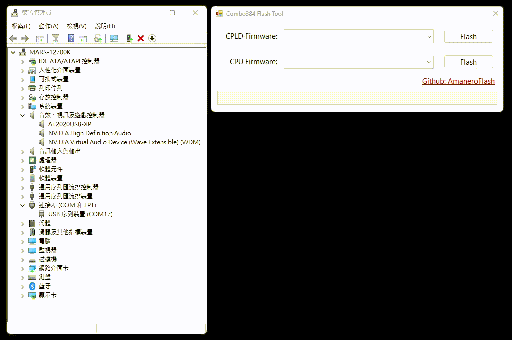

# AmaneroFlash
A firmware flash tool for **Cloned/China** Amanero Combo384 USB card


## DEMO
### Windows GUI:


### Python:
```pip install -r requirements.txt```


## Firmware
### CPLD
+ **CPLD_for_1080**
    + CPLD code for firmware DSD512x48x44 and versions 1.09x

+ **CPLD_for_1081**
    + CPLD code for native DSD firmware_2006be10+ DSD channels are not swapped

+ **CPLD_1080_DSDSWAPPED**
    + CPLD 1080 with DSD channels already swapped

+ **CPLD_1081_DSDSWAPPED**
    + CPLD 1081 with DSD channels already swapped

### CPU
+ **DSD512x48x44**
  + DSD512 from 44.1kHz or 48kHz

+ **firmware_1096c3w2**
  + Fixed dsd64 to pcm 176.4Khz problem

+ **firmware_1096c4w2**
  + I2C commands enabled

+ **firmware_1099akm**
  + native DSD supported for AKM

+ **firmware_1099c**
  + Alternate Settings 2 Little Endian Native DSD

+ **firmware_2006be10**
  + CPLD_for_1081/Slave_for_1081 is required - PCM384 and DSD512 native for Linux Big Endian - 

+ **firmware_2006be11**
    + Added DoP for Mac DSD256 - Native DSD512 for Linux/Windows - CPLD_for_1081/CPLD_1081_SWAPPED required. Windows Driver SetupUAC2 see firmware history on www.amanero.com
